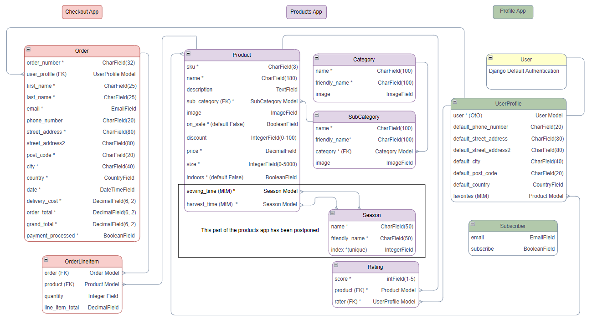
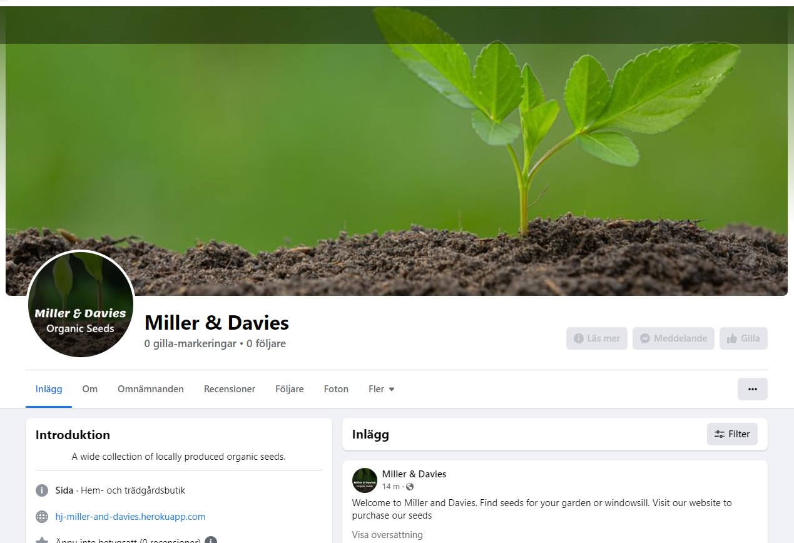

<h1 align="center">Miller  Davies</h1>

¨¨This is a web based app made to give the user a simple but effective tool to plan and track their gym workouts.
It is flexible in the sense that the user can add all the exercises and workouts they want and don't need to use an app crowded with extra 
features that they will never use.
The goal is for the user to set up the app at home on a wide screen and then easily view today's session at the gym.¨¨

[View the live project here]().  

## Table of Contents
**[User Experience](#user-experience)**  
**[Planning the Project](#planning-the-project)**  
**[Features](#features)**  
**[Technologies Used](#technologies-used)**   
**[Testing](#testing)**  
**[Deployment](#deployment)**  
**[Credits](#credits)**  
**[Acknowledgements](#acknowledgements)**  
**[Conclusion](#conclusion )**  

## User Experience
### Target Audience
The target audience for the Miller & Davies site is people of all ages that are interested in gardening and planting seeds. People from rural and suburban areas should be in majority even if urban people might be interested in the selection of seeds suitable for growing indoors.  
The site fulfills their needs of buying organic vegetable, flower and herb seeds.

### User Stories
The user stories for this project can be found in [this document](documentation/user_stories.md).

## Planning the Project
¨¨The planning of this project is done in Github Projects and follows an Agile strategy.
[Link to the project's Kanban Board](https://github.com/Odden69/ITrain/projects/1).  
I soon realized that, since this was the first time I ran a project like this, it was very hard to make any close time estimates. Therefore the time aspect has not been very highly prioritized in the planning of this project, instead I focused on the content and on always having a working app after each iteration. This was a big learning outcome and with more experience, I am sure the benefits of the agile planning method will be even more obvious.¨¨

### Database Diagram
To illustrate the logic of the database I used [diagrams.net](https://www.diagrams.net/).

### SEO
When brainstorming for ideas, I came up with a number of words and expressions I thought would be relevant searches for a user looking for a site like this. After searching for them on Google, using “others search for” and “related searches”, and finally Wordtracker, I ended up with these words and phrases to use on the site to improve SEO:
- organic seeds
- gardening seeds
- vegetable seeds
- flower seeds
- herb seeds
- organic vegetable seeds
- organic flower seeds
- organic herb seeds
- organic vegetable seeds online
- seeds online
- seeds for vegetables
- seeds for garden
- seeds for windowsill

These keywords and expressions has been added to the sites keywords and to headers throughout the site, to improve its ranking by search engines.

This project is still in its early stages and needs a lot of more content before it is a fully developed website. The SEO will improve with relevant information about
gardening, tools and inspiration for users on different levels of background knowledge.   

### Wireframes
The wireframes for this project can be found in [this document](documentation/wireframes.md).

## Features
### Existing Features

  
Click to see the existing features

¨¨#### Unauthorized Users
The Start Page  
An unauthorized user meets a concise start page with a short message of the main idea of the app. Here they find a link to a login page and from there a sign up page, if needed.  
A link to an about page is also provided to let the user read more.  

The About Page  
On this page the user can see the benefits of the app. It is supposed to be appealing to the eye and to motivate the user to sign up and get access to the rest of the site.  

The Sign Up Page  
This page is a standard Django sign up page. On this site the user only enters a username and a password to sign up.  
 

#### Authorized Users
The Calendar  
When a user is logged in, the home page consists of a monthly view of a calendar. The user can see all their planned sessions in this period and move back and forward to the next and previous months with buttons. All planned sessions can be viewed by clicking on a session in the calendar. From this page the user also can create a new session.  

The Session Page  
This is the page the user uses at the gym. All planned workouts are visible together with the included exercises and its reps and sets. The workouts and exercises are clickable to see more information. From here the session can be edited in a separate form, or deleted.  
  

Workouts  
Here the users all created workouts are visible. Each workout is clickable to see more information. From the list, each workout can be edited in a separate form or deleted.  
By clicking the *Add Workout* button the user access a form to create a new Workout.

Exercises  
There are a couple of exercises included in the app. On this page they are visible, together with the ones the user created. Each exercise is clickable to see more information. From the list, the exercises created by the user, can be edited in a separate form or deleted.  
By clicking the *Add Exercise* button the user access a form to create a new Exercise.  

Muscle Groups  
There are a lot of muscle groups included in the app. On this page they are visible, together with the ones the user created. From the list, the muscle groups created by the user, can be edited in a separate form or deleted.  
By clicking the *Add Muscle Group* button the user access a form to create a new Muscle Group.  

The Help Page  
On the help page a user can find out how to use the ITrain app. Each category is clickable to easily find the information the user is searching for.  

¨¨

### Features Left to Implement
¨¨There are quite a few features on my wishing list for this site. Apart from some user interface improvements, like pagination of lists and an up to top button on scrolling pages, there are lots of improvements to make.
- I would like the calendar to be clickable on a date to create a session instead of using a separate button.
- I would like to add tags to exercises and workouts and also add dynamic filters to the forms and list views, for easier searches when the user can filter on tags and muscle groups.
- There should be a user account page where password and usernames could be changed.
- I would like to add a checkbox where a workout and an exercise can be disabled and not visible in the forms, but saved for future use.
- I would like a copy function to create a session similar to an old one.
- An option to add images, especially to exercises.
- A nice thing would be to add a notification feature, where the user gets a reminder before a session.¨¨

## E-Commerce Business Model and Marketing Strategies
This is an E-commerce site in its simplest form, a B2C business model only meant for stand-alone transactions to private customers where no subscribed transactions are offered.

Miller and Davies' marketing strategies are to be seen on social medias and to send newsletter to signed up customers.  
There are Facebook and Instagram links in the footer of the site to pages where the business is promoted by regular posts with inspiration and information.  
The newsletter is sent out regularly to promote news and offers, and to share information and inspiration with the customers.  
(Since this is just a project created for educational purposes, the links on the site are not directed to a specific facebook or instagram page.)  
This image shows what a facebook page created for this site might look like.  

## Technologies Used
### Programming Languages
**Python**  
**CSS**  
**HTML**  
**JavaScript**  

### Libraries and Frameworks
The whole project is built on the [**Django**](https://www.djangoproject.com/) framework and quite a few different django libraries are used throughout the project.  
  
To check the python code, dynamically, I installed **pylint-django** and **pylint-plugin-utils**.  
  
To aid the styling and responsivness process I used [**Bootstrap 5**](https://getbootstrap.com/).  

### Programs and Sites
The site is deployed on [**Heroku**](https://www.heroku.com/) with a **gunicorn** server and a **psycopg2** adapter, using an external **PostgreSQL** database on [**ElephantSQL**](https://www.elephantsql.com/).  
  
To store the static and media files for deployment I used [**AWS**](https://aws.amazon.com/).  
  
The payment service used is [**Stripe**](https://stripe.com/).  
  
For the Logo font I used [**Google Fonts**](https://fonts.google.com/).  
  
The icons are collected from [**Font Awsome**](https://fontawesome.com/).  
 

## Testing
¨¨All through the development process the site has been undergoing manual testing to confirm the intended functionality.

Up to a certain point in the project (a commit made on April 28th), the code was also tested with automated testing by unit testing. At that point the tests passed, with one exception, and the coverage was 100%. Since then the project grew without me maintaining the testing files, therefore tests now fail and the coverage, especially for views, are really low.
But even if the automated testing was not completed, the work I put into it was not wasted. I learned a lot about testing but also about how some of the code works which I before that had some trouble understanding.¨¨

### Testing User Stories from User Experience (UX) Section
¨¨All user stories in the list [above](#user-stories) has been tested and confirmed after implementation, apart from the ones marked with an asterisk, which will be implemented at a later stage.¨¨

### Validation and Responsivity
¨¨The validations of the code were made on these sites:
- Python : [pep8online](http://pep8online.com/checkresult)
- CSS : [jigsaw W3C](https://jigsaw.w3.org/css-validator/validator)
- HTML : [WS HTML Validator](https://validator.w3.org/)
- JavaScript : [JSHint](https://jshint.com/)

The tests were all without errors with two exceptions described in this [Test Document](documentation/Testing_ITrain.xlsx).  
 
All pages were tested in **Lighthouse** validation. Apart from some performance results on a phone, all results were very close to 100%. These tests are also documented in the [Test Document](documentation/testing_itrain.xlsx).

All the links on the site have been tested, as well as the function of the forms.
These tests include testing of the CRUD functionality and the use of confirmation messages.
These tests are documented in the [Test Document](documentation/testing_itrain.xlsx) as well.¨¨

### Color Contrast Check
¨¨The color contrast was checked on [Contrast Grid](https://contrast-grid.eightshapes.com/?version=1.1.0&background-colors=&foreground-colors=%23FFFFFF%2C%20White%0D%0A%23000%2C%20black%0D%0A%2312110D%0D%0A%23A87556%0D%0A%23C7C7BC%0D%0A%236F310A%0D%0A&es-color-form__tile-size=compact&es-color-form__show-contrast=aaa&es-color-form__show-contrast=aa&es-color-form__show-contrast=aa18&es-color-form__show-contrast=dnp).  ¨¨

### Known Bugs
¨¨- The major bug left, that I've not been able to solve, is the requirement of an existing exercise in a workout. It is now possible to save a workout without any exercises at all and this was not the intended functionality.

- Another bug (or bugs) left, which is not hard to fix, but takes some coding to do which I didn't have time for, is a unique name issue. When I sketched on the database I did a mistake and made the names of muscle-groups, exercises and workouts unique, and also the session date. But of course these attribute cannot be unique in the database, but needs to be unique from the users point of view. The models are now changed and the unique conditions are gone but I will need to add some if statements in the views which prevents the user from creating duplicates.¨¨

## Deployment
### Clone a GitHub repository
To make a local copy of this project you can make a clone by following these steps:
- Log in to GitHub and find the [repository](https://github.com/Odden69/ITrain).
- Above the list of files click on the code button. By the https address there is a copy symbol, click on that.
- Open Git Bash
- Change the current working directory to the location where you want the cloned directory.
- Type "git clone", and paste in the copied URL.
- Press Enter to create your local clone.

### Deploy to Heroku
This site was deployed to Heroku Apps. The instructions below have been updated after my initial deployment since I changed the storage of the static files from Cloudinary to WhiteNoise.

To deploy a copy of this site, follow these steps:
- Start by installing everything in the requirements.txt file.
- Make sure you have correct requirements.txt and Procfile before moving on with the deployment.
- Log in to [Heroku apps](https://heroku.com/)
- On the Heroku dashboard go to the "New" menu and choose "Create new app".
- Give the app a name that needs to be unique, select your region and click "Create app".
- Now the new app's dashboard is opened. Click on the resources tab.
- Add the Heroku Postgres Add-on.
- Go to the settings tab and reveal the Config Vars. 
- Add a SECRET_KEY Config Var and give it a string value of your choice. Preferably, use a secret key generator.
- To run the project locally you need to create an env.py file in your top level directory.
  - Copy the DATABASE_URL from Heroku's Config Vars. 
  - Add os.environ["DATABASE_URL"] to the env.py file and set it to the DATABASE_URL copied from Heroku.
  - Add os.environ["SECRET_KEY"] to your env.py file, copy the value of your SECRET_KEY in Heroku and paste it here.
- IMPORTANT! Make sure your env.py file is added to your .gitignore file so that your sensitive information is kept secret.
- Update the ALLOWED_HOSTS variable in the settings.py file by replacing *hj-itrain* with the name of your Heroku app. 
- Add, commit and push your changes to GitHub
- Login to Heroku from your terminal with: *heroku login -i*
- Get your app name from Heroku with: *heroku apps*
- Set the Heroku remote with: *heroku git:remote -a <app_name>*
- Push your changes to Heroku with: *git push heroku main*
- Run the app by clicking the Open app button on top of the page on the Heroku dashboard.
Good luck!

## Credits
### Code
¨¨
- [Django documentation](https://docs.djangoproject.com/en/4.0/)  
  If I had used a paper version of the Django documentation, I would have worn out the pages about Models and ModelForms.
- On a [Blog by Valentino Gagliardi](https://www.valentinog.com/blog/testing-django) I found tips about automatic testing in Django.
- [Blog by Hui Wen](https://www.huiwenteo.com/normal/2018/07/24/django-calendar.html). Here I found the code for the calendar.
- [Simple IT Rocks](https://simpleit.rocks/python/django/dynamic-add-form-with-add-button-in-django-modelformset-template/) is where I copied the code from to dynamically add exercise formsets to the Workout form.
- A post on [Stackoveflow](https://stackoverflow.com/questions/41129551/django-creating-an-if-statement-based-on-the-request-path-not-working) showed me how to highlight the active page in the navbar.
- I struggled for a while to add a filter to a formset field. This was where I found the solution: [Django project forum](https://forum.djangoproject.com/t/filter-dropdown-options-in-django-inline-formset-based-on-attribute-of-through-model/13374/4).
- As usual, [Stackoveflow](https://stackoverflow.com) has been frequently searched during the project, as well as [w3school](https://www.w3schools.com/).¨¨

### Other
¨¨
- The background image came from [pxhere](https://pxhere.com/sv/photo/1283826?utm_content=shareClip&utm_medium=referral&utm_source=pxhere), as well as the images on the about page.
- The Logo came from [focusfitness](https://www.focusfitness.net/stock-photos/downloads/fit-woman-chatting-phone-exercising-treadmill/).
- The colour scheme was extracted from the background image and some complementary colour were added on [coolors](https://coolors.co/).¨¨

## Acknowledgements
¨¨
- First of all my mentor Narender Singh deserves a big thank you for mental support and cheering, and also for some hands on technical advice, when I got stuck.
- A big thank you to Ed and the other tutors who showed me the importance of taking a step back to view problems from a new angle, and who supported me with help at some crucial stages in the project.
- As usual the slack crowd can't be thanked enough. Especially I like to thank StevenW_5p for a lot of tips and encouragement all through this project.
- And a giant thank you to my, always supportive, friends from my very first Hackathon. Thanks Andrew, Patrik and Kat for your support through the whole project and for the time you spent on checking the site!¨¨

## Conclusion
¨¨
This coding journey keeps proving itself as a bumpy road, or bumpy is not the right word, it's passing low valleys and high peaks.
Sometimes it feels really overwhelming looking up, and then, after having your neck bent down and the eyes focused on the ground for a while, the top of the hill is there and the feeling is awesome!
Before this course, and at some points during this project, I didn't think I would get this far, but here I am :smile:!
¨¨

[Back to the top](#table-of-contents)