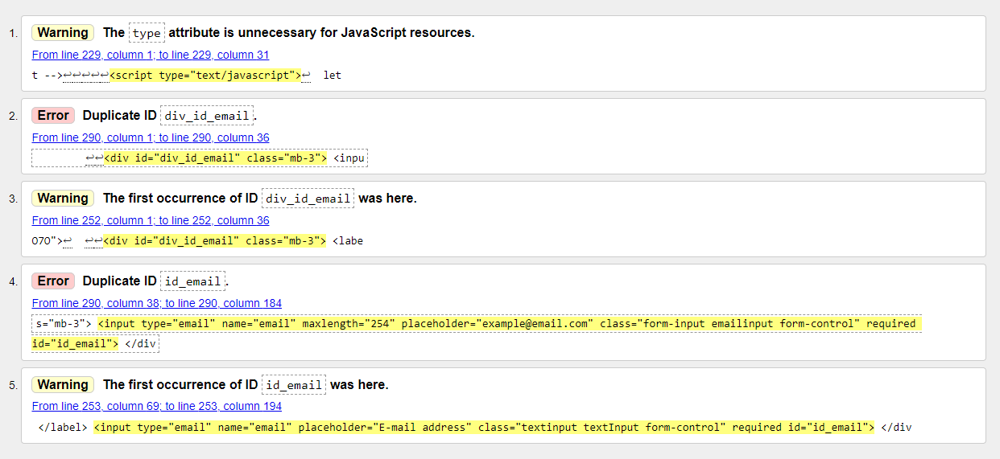
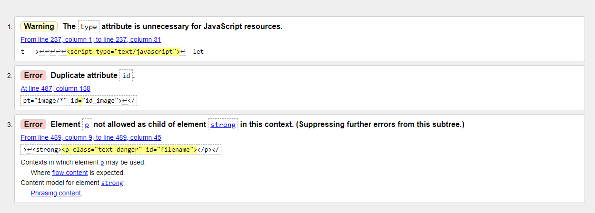
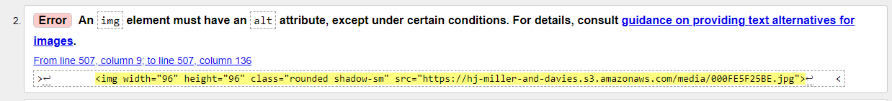

## Manual Testing of Miller and Davies

### Link Tests
| Link | Action | Confirmation Message |
|:-------------|:-----------:|:------------------------:|
| **Footer** |  |  |
| Facebook | :heavy_check_mark: | - |
| Instagram | :heavy_check_mark: | - |
| |  |  |
| **Header, wide screen** |  |  |
| Logo | :heavy_check_mark: | - |
| Basket | :heavy_check_mark: | - |
| **Header, small screen** |  |  |
| Logo |  |
| |  |  |
| **Navbar, not logged in, wide screen** |  |  |
| Products, By Name|  | - |
| Products, By Price|  | - |
| Products, By Rating|  | - |
| Vegetables |  | - |
| Flowers |  | - |
| Herbs |  | - |
| Indoor Growing |  | - |
| Bargains |  | - |
| Favorites|  | - |
| User, Sign Up |  | - |
| User, Log In |  | - |
| |  |  |
| **Navbar, not logged in, small screen** |  |  |
| Collapse, Products, By Name |  | - |
| Collapse, Products, By Price |  | - |
| Collapse, Products, By Rating |  | - |
| Collapse, Vegetables, All |  | - |
| Collapse, Vegetables, Cucurbits |  | - |
| Collapse, Vegetables, Leafy Greens |  | - |
| Collapse, Vegetables, Legumes |  | - |
| Collapse, Vegetables, Onions |  | - |
| Collapse, Vegetables, Peppers |  | - |
| Collapse, Vegetables, Root Veg |  | - |
| Collapse, Vegetables, Tomatoes |  | - |
| Collapse, Vegetables, Various Veg |  | - |
| Collapse, Flowers, All |  | - |
| Collapse, Flowers, Annuals |  | - |
| Collapse, Flowers, Biennials |  | - |
| Collapse, Flowers, Perennials |  | - |
| Collapse, Herbs |  | - |
| Collapse, Indoor Growing |  | - |
| Collapse, Bargains |  | - |
| Collapse, User, Sign Up |  | - |
| Collapse, User, Log In |  | - |
| Basket |  | - |
| **Navbar, reg user, wide screen** |  |  |
| User, My Profile |  | - |
| User, Log Out |  | - |
| **Navbar, reg user, small screen** |  |  |

| **Navbar, admin user, wide screen** |  |  |
| **Navbar, admin user, small screen** |  |  |
| **Header** |  |  |

### Page Tests
I have marked pages with green and yellow Lighthouse Validations and with warnings in the HTML-validator as checked.
A red Lighthouse Validation and an error in the HTML-validator has a comment in the table. Check the documentation below for more information about those comments.

| Page | Lighthouse, Desktop | Lighthouse, Mobile | Responsive, Desktop | Responsive, Tablet | Responsive, Mobile | HTML-validator W3 |
|:-----|:-------------------:|:------------------:|:-------------------:|:------------------:|:------------------:|:-----------------:|
|  |  |  |  |  |  |  |
| Product | Performance | Performance |  |  |  |:heavy_check_mark:|
| Product, Vegetables | Performance | Performance |  |  |  |:heavy_check_mark:|
| Prod, Veget,Legumes |:heavy_check_mark:|:heavy_check_mark:|  |  |  |:heavy_check_mark:|
| Product, Herbs | Performance |:heavy_check_mark:|  |  |  |:heavy_check_mark:|
| Product, Flowers |:heavy_check_mark:| Performance |  |  |  |:heavy_check_mark:|
| Product, Indoors |:heavy_check_mark:| Performance |  |  |  |:heavy_check_mark:|
| Product, Bargains |:heavy_check_mark:| Performance |  |  |  |:heavy_check_mark:|
| Product, Favorites |:heavy_check_mark:| Performance |  |  |  |:heavy_check_mark:|
| Product Detail |:heavy_check_mark:|:heavy_check_mark:|  |  |  |:heavy_check_mark:|
| Basket, Empty |:heavy_check_mark:|:heavy_check_mark:|  |  |  |:heavy_check_mark:|
| Basket, with content |:heavy_check_mark:|:heavy_check_mark:|  |  |  |:heavy_check_mark:|
| Checkout |:heavy_check_mark:|:heavy_check_mark:|  |  |  | Duplicate ID on email field |
| Order Confirmation |:heavy_check_mark:|:heavy_check_mark:|  |  |  |:heavy_check_mark:|
| Log In |:heavy_check_mark:|:heavy_check_mark:|  |  |  |:heavy_check_mark:|
| Log Out |:heavy_check_mark:|:heavy_check_mark:|  |  |  |:heavy_check_mark:|
| Sign Up |:heavy_check_mark:|:heavy_check_mark:|  |  |  | Duplicate ID on email field |
| Profile | Performance |:heavy_check_mark:|  |  |  |:heavy_check_mark:|
| Past Order Confirmation |:heavy_check_mark:|:heavy_check_mark:|  |  |  |:heavy_check_mark:|
| Add product |:heavy_check_mark:|:heavy_check_mark:|  |  |  | See image below |
| Edit product |:heavy_check_mark:|:heavy_check_mark:|  |  |  | See image below |

The HTML-validator testing in this project taught me that in the future I will do that kind of testing continuously. It would have spared me a lot of work at the stressful final stage of the project.  
I ended up with a few errors left. All but one coming from labels and fields on forms. These errors could obviously have been solved, but since these errors all showed up on pages generated by Allauth or from code in large copied from the Boutique Ado project, it would have taken more skills to penetrate them than I was able to muster with no time left.  

#### HTML Errors

  
Click to see HTML Errors
 

HTML Errors on the Sign Up Page  
Duplicate id:s generated from the Allauth form.  
  
HTML Errors on the Add Product Page
Duplicate attributes and a p tag inside a strong element. I am not sure why it was done like this, and since it was working I left it without change.  
  
HTML Errors on the Edit Product Page  
The small image on the edit product form should have an alt attribute.  
  

#### Red Lighthouse Validations 

One error from the HTML testing was repeated in the Lighthouse Validation, but apart from that it all came down to performance issues. See [this document](lighthouse_validation.pdf) for the results on different pages.

| |  |  |
| **Header, wide screen** |  |  |
| Logo | :heavy_check_mark: | - |
| Basket | :heavy_check_mark: | - |

### Code Tests
The code has been checked and all errors in the code have been taken care of.  
  
| File | Jigsaw validator | pep8 pylint django | JSHint |
|:-----|:----------------:|:------------------:|:------:|
|  |  |  |  |
| **Basket** |  |  |  |
| contexts.py | - | :heavy_check_mark: | - |
| urls.py | - | :heavy_check_mark: | - |
| views.py | - | :heavy_check_mark: | - |
|  |  |  |  |
| **Checkout** |  |  |  |
| admin.py | - | :heavy_check_mark: | - |
| forms.py | - | :heavy_check_mark: | - |
| models.py | - | :heavy_check_mark: | - |
| signals.py | - | :heavy_check_mark: | - |
| urls.py | - | :heavy_check_mark: | - |
| views.py | - | :heavy_check_mark: | - |
| webhook_handler.py | - | :heavy_check_mark: | - |
| webhooks.py | - | :heavy_check_mark: | - |
| checkout.css | :heavy_check_mark: | - | - |
| stripe_elements.js | - | - | :heavy_check_mark: |
|  |  |  |  |
| **Favorites** |  |  |  |
| urls.py | - | :heavy_check_mark: | - |
| views.py | - | :heavy_check_mark: | - |
|  |  |  |  |
| **Newsletters** |  |  |  |
| admin.py | - | :heavy_check_mark: | - |
| contexts.py | - | :heavy_check_mark: | - |
| forms.py | - | :heavy_check_mark: | - |
| models.py | - | :heavy_check_mark: | - |
|  |  |  |  |
| **Products** |  |  |  |
| admin.py | - | :heavy_check_mark: | - |
| forms.py | - | :heavy_check_mark: | - |
| models.py | - | :heavy_check_mark: | - |
| urls.py | - | :heavy_check_mark: | - |
| views.py | - | :heavy_check_mark: | - |
| widgets.py | - | :heavy_check_mark: | - |
| quantity_input_script.html | - | - | :heavy_check_mark: |
| rate_product_script.html | - | - | :heavy_check_mark: |
| edit_product.html | - | - | :heavy_check_mark: |
|  |  |  |  |
| **Profiles** |  |  |  |
| admin.py | - | :heavy_check_mark: | - |
| forms.py | - | :heavy_check_mark: | - |
| models.py | - | :heavy_check_mark: | - |
| urls.py | - | :heavy_check_mark: | - |
| views.py | - | :heavy_check_mark: | - |
| profile.css | :heavy_check_mark: | - | - |
| countryfield.js | - | - | :heavy_check_mark: |
|  |  |  |  |
| **Miller_n_davies** |  |  |  |
| forms.py | - | :heavy_check_mark: | - |
| settings.py | - | :heavy_check_mark: | - |
| urls.py | - | :heavy_check_mark: | - |
| views.py | - | :heavy_check_mark: | - |
|  |  |  |  |
|  |  |  |  |
| custom_storages.py | - | :heavy_check_mark: | - |
| base.css | :heavy_check_mark: | - | - |

